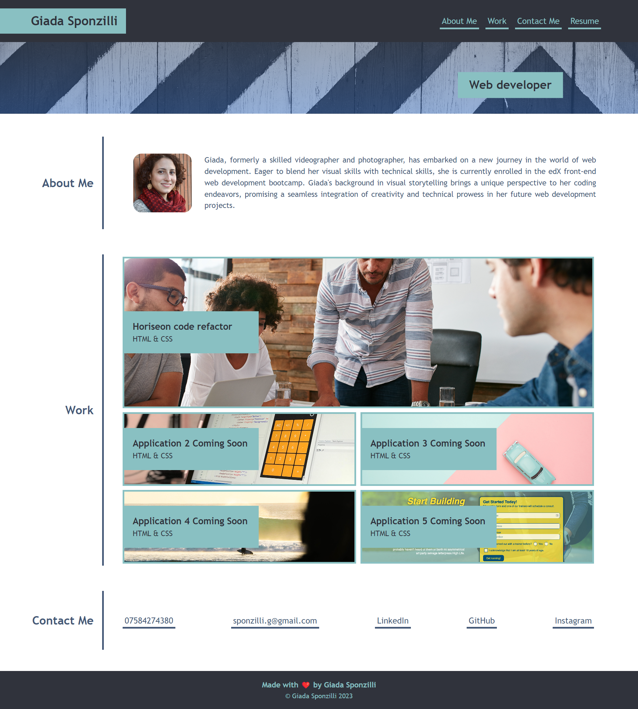
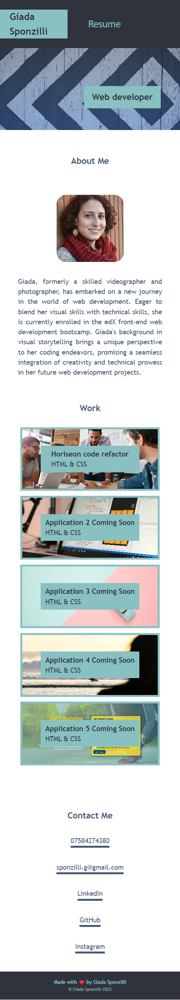

# giada-sponzilli-portfolio

## Description

This portfolio wants to showcase my skills as a web developer to future employers.
The webiste is a skeleton for my future projects. Currently, I have only one coding project which is linked to the website in my first application section.
The resume button is linked to a google doc resume of my previous job, as soon as I will have my new resume as a web developer it will be update.
At the bottom of the page there is a section with my contacts to make it easier for employers who wish to reach out for possible interviews.
The website has been made using flexboxes, grids, variables and pseudo-classes.

The code is deployed at https://giadasponzilli.github.io/giada-sponzilli-portfolio/

## Screenshots

## Installation

N/A

## Usage

This application can be used by employers to take a look at my skills and projects as a web developer.

## Credits

N/A

## License

MIT License

## Badges

